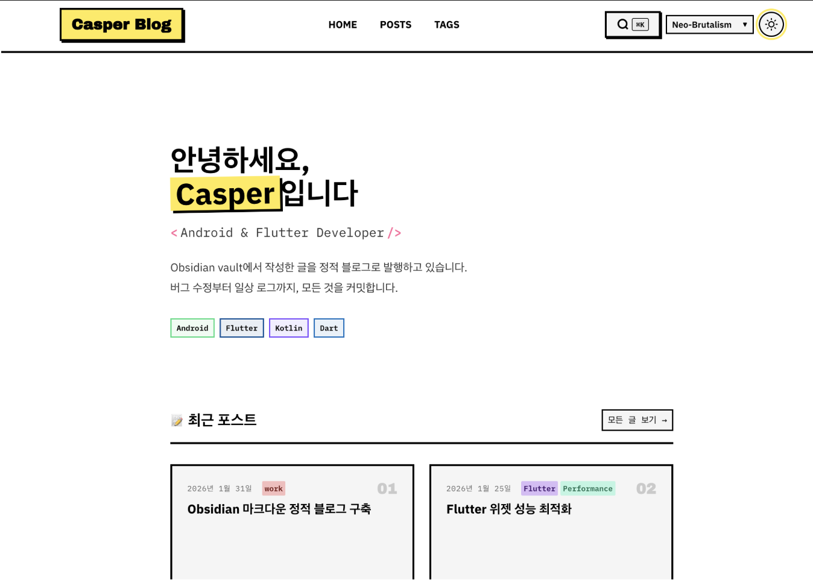

# girok.md (기록.md)

> **Your record becomes a map for others.**

*Read this in other languages: [English](README.md), [한국어](README.ko.md)*

An open-source static blog generator that transforms your markdown files into a beautiful blog.

<p align="center">
  
</p>

[](https://astro.build)
[](https://www.typescriptlang.org/)
[](https://opensource.org/licenses/MIT)

---

## Philosophy

**The Power of Recording**

- **Personal Records**: Traces left behind so I don't forget what I've learned.
- **Shared Records**: Milestones from my journey that help others grow.

Your notes are more than personal memos—they become a map that guides someone else's path.

---

## Features

- **Markdown Native**: Full support for Wikilinks, image embeds, and Callouts
- **Incremental Sync**: Only syncs changed files based on `publish_sync_at` timestamp
- **Full-Text Search**: Client-side search powered by Pagefind
- **Tag System**: Browse and filter posts by tags
- **Dark/Light Theme**: System preference detection with manual toggle
- **SEO Optimized**: Auto-generated sitemap and meta tags
- **GitHub Pages**: One-click deployment support

## Quick Start

### 1. Clone the Project

```bash
git clone https://github.com/your-username/girok-md.git
cd girok-md
npm install
```

### 2. Configuration

Edit the `setting.toml` file:

```toml
# Absolute path to your markdown files
source_root_path = "/path/to/your/markdown/folder"

# Blog name
blog_name = "My Blog"

# Site URL (for SEO)
site_url = "https://your-username.github.io"
```

### 3. Sync and Run

```bash
# Sync posts from your markdown folder
npm run sync

# Start development server
npm run dev
```

Visit http://localhost:4321 to see your blog.

## Writing Posts

Add `publish: true` to your document's frontmatter to publish it to your blog.

```yaml
---
title: Post Title
publish: true
tags: [astro, blog]
description: Post description (optional)
---

Write your content here.
```

### Supported Markdown Syntax

| Syntax | Example | Result |
|--------|---------|--------|
| Wikilinks | `[[Document]]` | Internal link |
| Aliased Links | `[[Document\|Display Text]]` | Custom text link |
| Image Embeds | `![[image.png]]` | Image tag |
| Callouts | `> [!NOTE]` | Styled callout box |

## Project Structure

```
.
├── src/
│   ├── components/       # Astro components
│   │   ├── Search.astro      # Pagefind search
│   │   ├── ThemeToggle.astro # Theme switcher
│   │   ├── TOC.astro         # Table of contents
│   │   └── TagList.astro     # Tag list
│   ├── layouts/          # Layouts
│   ├── pages/            # Routes
│   │   ├── index.astro       # Home
│   │   ├── posts/            # Post pages
│   │   └── tags/             # Tag pages
│   ├── content/
│   │   └── posts/        # Synced posts (auto-generated)
│   ├── styles/           # Global CSS
│   └── utils/            # Utilities
├── scripts/
│   └── sync.ts           # Markdown sync script
├── public/               # Static files
├── setting.toml          # Blog configuration
└── astro.config.mjs      # Astro configuration
```

## Commands

| Command | Description |
|---------|-------------|
| `npm run dev` | Start development server (localhost:4321) |
| `npm run build` | Build for production |
| `npm run preview` | Preview production build |
| `npm run sync` | Sync from markdown folder |
| `npm test` | Run tests |

## Deployment

### GitHub Pages

1. Go to Repository Settings > Pages > Source: select "GitHub Actions"
2. Push to the `main` branch to trigger automatic deployment

### Manual Build

```bash
npm run build
# Upload the dist/ folder to your web server
```

## Sync Logic

The sync process works incrementally:

1. Only documents with `publish: true` are included
2. Compares document's `modified` time with `publish_sync_at`
3. Only syncs changed documents for optimized build times
4. Automatically removes documents that are deleted or set to `publish: false`

## Tech Stack

- **Framework**: [Astro](https://astro.build) 5.x
- **Language**: TypeScript (strict mode)
- **Markdown**: remark, rehype
- **Search**: [Pagefind](https://pagefind.app)
- **Testing**: Vitest, Playwright

## Contributing

1. Fork the repository
2. Create your feature branch (`git checkout -b feature/amazing-feature`)
3. Commit your changes (`git commit -m 'Add some amazing feature'`)
4. Push to the branch (`git push origin feature/amazing-feature`)
5. Open a Pull Request

## License

[MIT](LICENSE)
